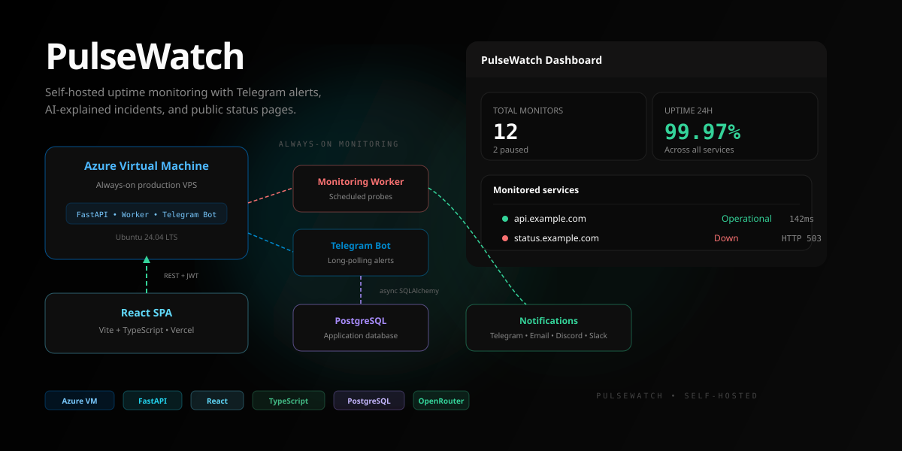
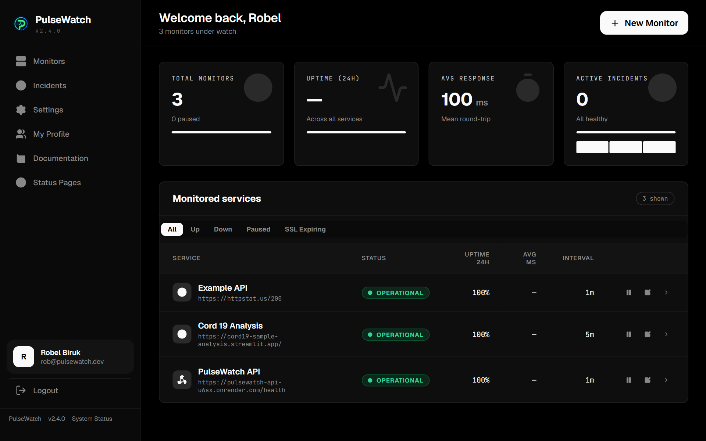
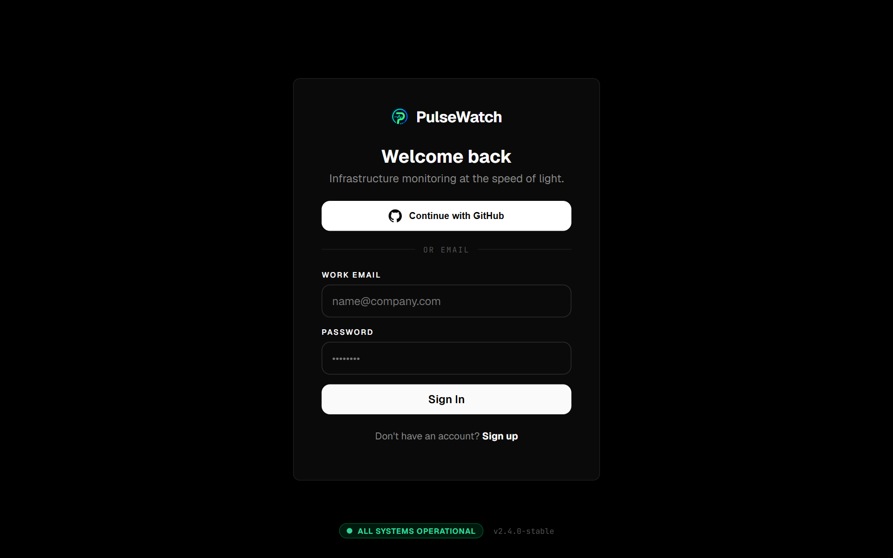
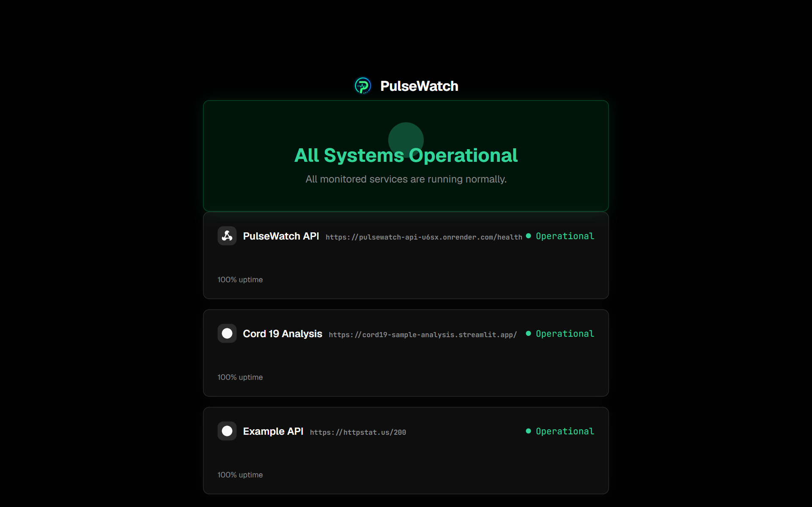
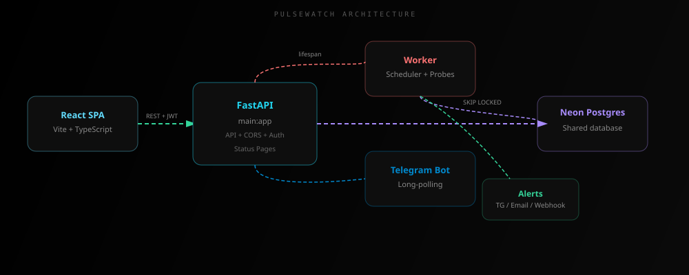

<div align="center">



</div>

<div align="center">

# 🔭 PulseWatch

### Self-hosted uptime monitoring with Telegram alerts, AI-explained incidents, and public status pages.

[](LICENSE)


</div>

<br/>

<div align="center">

<a href="https://github.com/Robibiruk/PulseWatch">GitHub</a> · <a href="https://t.me/iamrobiii">Telegram</a> · <a href="https://www.linkedin.com/in/robel-biruk-5923101b5/">LinkedIn</a> · <a href="https://pulsewatch-monitor.vercel.app">Live Demo</a> · <a href="#quick-start">Quick Start</a>

</div>

<br/>

<div align="center">

## ✨ What is PulseWatch?

</div>



> PulseWatch is a **self-hosted full-stack uptime monitoring platform** for developers who want to know when their services break before users notice.
>
> It continuously probes your endpoints, tracks uptime history, detects repeated failures, automatically opens and resolves incidents, sends alerts through multiple channels, and provides a **public status page** you can share with users.
>
> PulseWatch also uses **OpenRouter-powered AI** to analyze the monitoring evidence collected when an incident occurs and generate a concise, plain-English explanation of the observed failure pattern.

<div align="center">

|           🔔 **Instant Alerts**           |          📊 **Live Dashboard**          |         🌐 **Public Status**         |                🤖 **AI Analysis**               |
| :---------------------------------------: | :-------------------------------------: | :----------------------------------: | :---------------------------------------------: |
| Telegram, Email, Discord, Slack, Webhooks | Real-time KPIs, uptime %, response time | Shareable status board with 3 themes |       OpenRouter-powered incident analysis      |
|     [Notifications](#-notifications) →    |        [Dashboard](#-features) →        |     [Status Pages](#-features) →     | [AI Explanations](#-ai-incident-explanations) → |

</div>

---

<div align="center">

## 🚀 Quick Start

</div>

### 1. Clone the repository

```bash
git clone https://github.com/Robibiruk/PulseWatch.git
cd PulseWatch
```

### 2. Backend

```bash
cd backend

python3 -m venv .venv
source .venv/bin/activate

pip install -r requirements.txt

cp .env.example .env
nano .env
```

At minimum, configure:

```env
DATABASE_URL=postgresql+asyncpg://...
SECRET_KEY=<long-random-secret>
CORS_ORIGINS=http://localhost:5173
```

Start FastAPI:

```bash
uvicorn main:app --reload --port 8000
```

The API runs at:

```text
http://localhost:8000
```

Interactive API documentation:

```text
http://localhost:8000/docs
```

### 3. Frontend

Open another terminal:

```bash
cd frontend
npm install
npm run dev
```

Open:

```text
http://localhost:5173
```

Register an account and add your first monitor.

---

<div align="center">

## 📸 See It in Action

</div>

<table>
  <tr>
    <td align="center">
      
      <br/>
      <b>Login</b><br/>
      <sub>JWT authentication + GitHub OAuth</sub>
    </td>
    <td align="center">
      
      <br/>
      <b>Dashboard</b><br/>
      <sub>Real-time KPIs + monitor fleet</sub>
    </td>
  </tr>
  <tr>
    <td align="center" colspan="2">
      
      <br/>
      <b>Public Status Page</b><br/>
      <sub>Auth-free shareable board with neon, light, and minimal themes</sub>
    </td>
  </tr>
</table>

---

<div align="center">

## ⚡ Features

</div>

<div align="center">

| Category                  | What you get                                                                                                        |
| :------------------------ | :------------------------------------------------------------------------------------------------------------------ |
| **HTTP Monitoring**       | HTTP/HTTPS checks, configurable intervals, timeouts, redirects, HTTP methods, authentication, and status-code rules |
| **Heartbeat Monitoring**  | Push-based monitoring for cron jobs, workers, and background services                                               |
| **SSL Monitoring**        | SSL/TLS error detection and certificate expiry monitoring                                                           |
| **Domain Monitoring**     | Domain expiry reminders                                                                                             |
| **Alerts**                | Telegram, Email, Discord, Slack, and generic JSON webhooks                                                          |
| **Dashboard**             | Real-time KPIs, uptime percentage, response times, filters, and monitor fleet                                       |
| **Incidents**             | Automatic incident creation, recovery detection, duration tracking, and incident history                            |
| **AI Analysis**           | OpenRouter-powered incident explanations based on actual monitoring evidence                                        |
| **Status Pages**          | Public, authentication-free status pages with three visual themes                                                   |
| **Telegram Bot**          | `/status`, `/monitors`, `/incidents`, `/pause`, `/resume`, and `/help`                                              |
| **Authentication**        | Email/password, JWT authentication, bcrypt password hashing, GitHub OAuth, and API tokens                           |
| **Monitor Configuration** | Timeout, redirects, IP version, authentication, HTTP method, accepted status codes, and tags                        |

</div>

---

<div align="center">

## 🏗 Architecture

</div>



### Production architecture

PulseWatch currently runs as a **self-hosted production deployment on an Azure Linux VM**.

The frontend is deployed separately and communicates with the FastAPI backend running on the Azure VM.

The Azure VM provides the persistent compute required for:

* FastAPI
* The continuous monitoring worker
* Telegram long-polling
* Incident processing
* Notification dispatch

The production deployment uses a **fresh PostgreSQL database** for persistent application and monitoring data.

**Neon is not used by the current production deployment.**

OpenRouter is connected to the backend for AI-powered incident analysis.

```text
                    ┌──────────────────────┐
                    │        Vercel        │
                    │   React + Vite + TS  │
                    └──────────┬───────────┘
                               │
                         REST + JWT
                               │
                               ▼
              ┌─────────────────────────────────┐
              │          Azure Linux VM          │
              │                                  │
              │  ┌────────────┐  ┌────────────┐ │
              │  │  FastAPI   │  │   Worker   │ │
              │  │    API     │  │  Scheduler │ │
              │  └─────┬──────┘  └──────┬─────┘ │
              │        │                │       │
              │        └───────┬────────┘       │
              │                │                │
              │        ┌───────▼───────┐        │
              │        │  PostgreSQL   │        │
              │        │  Production   │        │
              │        │    Database   │        │
              │        └───────────────┘        │
              │                                  │
              │  Telegram Bot  ·  Notifications │
              └──────────┬──────────┬────────────┘
                         │          │
                         ▼          ▼
                    Telegram    OpenRouter
                                  │
                                  ▼
                              GPT-OSS-20B
```

### Azure VM

The Azure VM is the **persistent compute layer** of the current production deployment.

Unlike a sleeping application instance, the VM provides a continuously running environment for the monitoring engine.

The VM currently hosts:

```text
Azure Linux VM
├── FastAPI backend
├── Continuous monitoring worker
├── Telegram bot
└── PostgreSQL
```

This allows PulseWatch to continuously monitor external services without depending on a sleeping free-tier worker.

### Monitoring pipeline

```text
Scheduler
    ↓
Find due monitors
    ↓
Claim monitor
    ↓
HTTP / HTTPS / Heartbeat probe
    ↓
Save check result
    ↓
Update monitor state
    ↓
Failure threshold reached?
    ├── No → schedule confirmation check
    │
    └── Yes
          ↓
      Create incident
          ↓
      Analyze monitoring evidence
          ↓
      OpenRouter AI explanation
          ↓
      Send notifications
```

### Claim-based worker design

The monitoring scheduler uses database-backed monitor claims.

For PostgreSQL deployments, due monitors use row-level locking with `SKIP LOCKED`. A short lease prevents another worker from processing the same monitor simultaneously.

This provides a foundation for **horizontal worker scaling** without producing duplicate checks or duplicate alerts.

---

<div align="center">

## 🚢 Production Deployment

</div>

### Current production stack

| Component             | Host                       | Purpose                                         |
| :-------------------- | :------------------------- | :---------------------------------------------- |
| **Frontend**          | Vercel                     | React + Vite web application                    |
| **Backend API**       | Azure Linux VM             | FastAPI REST API                                |
| **Monitoring Worker** | Azure Linux VM             | Continuous uptime checks and incident detection |
| **Telegram Bot**      | Azure Linux VM             | Long-polling commands and Telegram alerts       |
| **Database**          | PostgreSQL                 | Persistent application and monitoring data      |
| **AI**                | OpenRouter                 | Incident explanation and analysis               |
| **Email**             | Resend                     | Email notifications                             |
| **Notifications**     | Discord / Slack / Webhooks | Additional alert channels                       |

### Azure deployment

The production backend is hosted on an **Azure Linux virtual machine**.

Azure provides the persistent compute environment for PulseWatch's API, monitoring worker, Telegram bot, and production database.

The VM is particularly important for PulseWatch because uptime monitoring requires a process that stays alive continuously.

The architecture therefore avoids depending on a sleeping application instance for the core monitoring loop.

### Production database

The current deployment uses a **fresh PostgreSQL database**.

It is not connected to Neon.

The database stores:

* User accounts
* Monitors
* Historical checks
* Incidents
* AI explanations
* Telegram connections
* Notification settings
* Public status pages
* API tokens

### Frontend deployment

The React frontend is deployed separately and communicates with the Azure-hosted API through:

```env
VITE_API_BASE=https://your-api-domain
```

### Backend deployment

The Azure VM runs the backend services required for PulseWatch:

```text
Azure VM
│
├── FastAPI API
├── Monitoring Worker
├── Telegram Bot
└── PostgreSQL
```

A production process manager such as `systemd` can be used to keep services alive and automatically restart them after failures or reboots.

---

<div align="center">

## 🤖 AI Incident Explanations

</div>

PulseWatch uses **OpenRouter** to analyze the evidence collected when a monitor enters an incident state.

The AI is not responsible for detecting outages. The monitoring engine detects the outage first.

The flow is:

```text
Monitor failure
      ↓
Failure threshold reached
      ↓
Incident created
      ↓
Monitoring evidence collected
      ↓
OpenRouter
      ↓
AI explanation
      ↓
Incident alert
```

### Current model

```text
openai/gpt-oss-20b
```

The model is configured through:

```env
OPENROUTER_MODEL=openai/gpt-oss-20b
```

### Evidence sent to the model

When an incident is created, PulseWatch can provide evidence such as:

* Current HTTP status code
* Current error
* Recent HTTP status codes
* Failure pattern

For example:

```text
Current HTTP status: 503
Current error: Service unavailable
Recent HTTP status codes: [200, 200, 503, 503, 503]
```

The model can recognize the observed transition:

```text
200 → 200 → 503 → 503 → 503
```

and explain that the monitored service was previously responding successfully before returning consecutive `503` responses.

### What the AI can and cannot know

The AI explanation is **evidence-based**, not a magical root-cause detector.

PulseWatch does not currently provide the model with:

* Application logs from the monitored service
* CPU metrics from the monitored service
* Memory metrics
* Database internals
* Server process information
* Cloud infrastructure metrics

Therefore, the AI should not claim that it knows the exact root cause.

For example, a sequence of `503` responses may be consistent with:

* Application failure
* Resource exhaustion
* Dependency failure
* Temporary service unavailability

These are possible explanations, not confirmed facts unless the monitoring evidence supports them.

### Example AI output

For:

```text
HTTP 503
Error: Service unavailable
Recent: [200, 200, 503, 503, 503]
```

the AI may produce an explanation identifying:

1. The currently observed `503` failure.
2. The transition from successful responses to consecutive failures.
3. Plausible underlying causes.
4. What evidence is missing.
5. A practical recovery estimate.

This makes the AI output useful while avoiding false certainty.

### Graceful fallback

If OpenRouter is unavailable, misconfigured, or no API key is provided, PulseWatch falls back to deterministic rule-based explanations.

Supported fallback conditions include:

* HTTP 500
* HTTP 502
* HTTP 503
* HTTP 504
* Connection failures
* DNS failures
* Request timeouts

The monitoring engine and incident system therefore continue functioning even when the AI service is unavailable.

---

<div align="center">

## 🔧 Environment Variables

</div>

### Core

| Variable       | Default                  | Description                                    |
| :------------- | :----------------------- | :--------------------------------------------- |
| `DATABASE_URL` | *(required)*             | PostgreSQL async URL or SQLite development URL |
| `SECRET_KEY`   | `dev-insecure-change-me` | JWT signing secret                             |
| `CORS_ORIGINS` | `http://localhost:5173`  | Comma-separated allowed browser origins        |

### Worker / Scheduler

| Variable             | Default | Description                                              |
| :------------------- | ------: | :------------------------------------------------------- |
| `POLL_INTERVAL`      |    `15` | Scheduler tick interval in seconds                       |
| `WORKER_CONCURRENCY` |    `20` | Maximum concurrent monitor checks                        |
| `NO_WORKER`          | `false` | Disable the built-in worker                              |
| `FAILURE_THRESHOLD`  |     `3` | Consecutive failures required before opening an incident |
| `CONFIRMATION_DELAY` |    `10` | Delay before confirmation/recovery checks                |

### Telegram

| Variable             | Default | Description                       |
| :------------------- | :------ | :-------------------------------- |
| `TELEGRAM_BOT_TOKEN` | `""`    | Telegram bot token from BotFather |
| `NO_TELEGRAM_BOT`    | `false` | Disable the Telegram bot          |

### Email

| Variable           | Default                 | Description             |
| :----------------- | :---------------------- | :---------------------- |
| `RESEND_API_KEY`   | `""`                    | Resend API key          |
| `ALERT_FROM_EMAIL` | `alerts@yourdomain.com` | Verified sender address |

### AI

| Variable             | Default              | Description                      |
| :------------------- | :------------------- | :------------------------------- |
| `OPENROUTER_API_KEY` | `""`                 | OpenRouter API key               |
| `OPENROUTER_MODEL`   | `openai/gpt-oss-20b` | Model used for incident analysis |

### Frontend

| Variable        | Default                 | Description          |
| :-------------- | :---------------------- | :------------------- |
| `VITE_API_BASE` | `http://localhost:8000` | Backend API base URL |

> Full configuration is available in [`backend/.env.example`](backend/.env.example).

---

<div align="center">

## 📡 API Reference

</div>

All authenticated routes require:

```http
Authorization: Bearer <jwt>
```

| Method   | Path                             | Description          |
| :------- | :------------------------------- | :------------------- |
| `POST`   | `/auth/register`                 | Register account     |
| `POST`   | `/auth/token`                    | Login and obtain JWT |
| `GET`    | `/auth/me`                       | Get current user     |
| `GET`    | `/monitors`                      | List monitors        |
| `POST`   | `/monitors`                      | Create monitor       |
| `PATCH`  | `/monitors/:id`                  | Update monitor       |
| `DELETE` | `/monitors/:id`                  | Delete monitor       |
| `GET`    | `/monitors/summary`              | Monitor fleet KPIs   |
| `GET`    | `/monitors/incidents`            | Recent incidents     |
| `GET`    | `/status/:userId`                | Public status board  |
| `POST`   | `/api/heartbeat/:token`          | Send heartbeat       |
| `GET`    | `/status/health`                 | API health check     |
| `POST`   | `/api/platform/tokens`           | Create API token     |
| `POST`   | `/api/platform/account/password` | Change password      |

Interactive Swagger documentation:

```text
http://localhost:8000/docs
```

---

<div align="center">

## 🤖 Telegram Bot

</div>

PulseWatch's Telegram bot uses **long-polling**, so no webhook configuration is required.

| Command          | Description                                 |
| :--------------- | :------------------------------------------ |
| `/start <token>` | Connect Telegram to your PulseWatch account |
| `/status`        | Show monitor status                         |
| `/monitors`      | List monitors                               |
| `/incidents`     | Show recent incidents                       |
| `/pause`         | Pause alerts                                |
| `/resume`        | Resume alerts                               |
| `/help`          | Show available commands                     |

### Connecting Telegram

```text
Dashboard
    ↓
Settings
    ↓
Connect Telegram
    ↓
Open Telegram deep link
    ↓
Press Start
    ↓
Account linked
```

---

<div align="center">

## 📬 Notifications

</div>

PulseWatch can send incident and recovery notifications through:

* **Telegram**
* **Email**
* **Discord**
* **Slack**
* **Generic JSON webhooks**

When a monitor reaches the failure threshold:

```text
Monitor failure
      ↓
Failure threshold reached
      ↓
Incident created
      ↓
AI explanation generated
      ↓
Notification dispatched
```

When the monitor recovers:

```text
Service recovers
      ↓
Incident resolved
      ↓
Recovery duration calculated
      ↓
Recovery notification sent
```

---

<div align="center">

## 🧪 Monitor Types

</div>

### HTTP / HTTPS

HTTP monitors support:

* Configurable check interval
* Request timeout
* HTTP methods
* Redirect following
* IPv4 / IPv6 / automatic selection
* Basic authentication
* Bearer authentication
* Accepted status-code groups
* SSL/TLS checks
* SSL certificate expiry reminders
* Domain expiry reminders
* Response-time tracking

### Heartbeat

Heartbeat monitoring is designed for services that cannot be continuously probed through a normal HTTP endpoint.

Your application sends a request to:

```text
POST /api/heartbeat/:token
```

If PulseWatch does not receive a heartbeat within the expected interval, the monitor is considered down and an incident can be opened.

This is useful for:

* Cron jobs
* Background workers
* Scheduled scripts
* Data pipelines
* Internal services

---

<div align="center">

## ❤️ Reliability

</div>

PulseWatch uses a failure threshold to reduce false alarms.

With the default configuration:

```text
Failure #1 → no incident
Failure #2 → no incident
Failure #3 → incident opened
```

A temporary one-request failure therefore does not immediately trigger an outage alert.

When the service starts responding again:

```text
Service recovers
      ↓
Incident resolved
      ↓
Recovery duration calculated
      ↓
Recovery notification sent
```

---

<div align="center">

## 🔐 Production Security Checklist

</div>

Before exposing a deployment publicly:

* [ ] Set `SECRET_KEY` to a long random value
* [ ] Set `CORS_ORIGINS` to the real frontend domain
* [ ] Never use `CORS_ORIGINS=*` in production
* [ ] Use PostgreSQL for production
* [ ] Keep `.env` out of Git
* [ ] Rotate API keys if they are accidentally exposed
* [ ] Keep `TELEGRAM_BOT_TOKEN` private
* [ ] Keep `OPENROUTER_API_KEY` private
* [ ] Put the API behind HTTPS
* [ ] Use a reverse proxy such as Nginx or Caddy
* [ ] Add rate limiting to authentication and public endpoints
* [ ] Keep the Azure VM and system packages updated
* [ ] Configure automatic service restart with `systemd`
* [ ] Restrict unnecessary Azure VM inbound ports
* [ ] Configure PostgreSQL backups
* [ ] Monitor the PulseWatch worker itself

Generate a strong secret with:

```bash
python3 -c "import secrets; print(secrets.token_urlsafe(48))"
```

---

<div align="center">

## 📁 Project Layout

</div>

```text
PulseWatch/
├── backend/
│   ├── main.py              # FastAPI app + lifespan
│   ├── worker.py            # Monitoring scheduler and incident engine
│   ├── checker.py           # HTTP, SSL and domain checks
│   ├── telegram_bot.py      # Telegram bot + account linking
│   ├── notifications.py     # Alert dispatch and notification formatting
│   ├── emailer.py           # HTML email templates
│   ├── ai_explain.py        # OpenRouter AI incident analysis
│   ├── models.py            # SQLAlchemy ORM models
│   ├── schemas.py           # Pydantic schemas
│   ├── database.py          # Database engine and initialization
│   ├── config.py            # Application configuration
│   ├── requirements.txt      # Python dependencies
│   └── routers/
│       ├── auth.py
│       ├── monitors.py
│       ├── status.py
│       ├── telegram.py
│       ├── heartbeat.py
│       ├── statuspage.py
│       ├── notifications.py
│       └── platform.py
│
├── frontend/
│   ├── src/
│   │   ├── App.tsx
│   │   ├── api.ts
│   │   ├── auth.tsx
│   │   ├── components/
│   │   └── pages/
│   └── vite.config.ts
│
├── docs-site/
│   ├── docs/
│   └── blog/
│
├── docs/
│   ├── diagrams/
│   └── screenshots/
│
└── README.md
```

---

<div align="center">

## 🗺 Roadmap

</div>

### Reliability

* Alembic migrations
* Durable job queue
* Second-region confirmation
* Rate limiting
* Better worker supervision
* Monitoring worker health
* Automated PostgreSQL backups

### Features

* Incident acknowledgement
* Maintenance windows
* Escalation policies
* Monitor tags and groups
* Longer-term SLA charts
* Team accounts and RBAC
* More notification integrations

### Infrastructure

* Docker / Docker Compose deployment
* Automated Azure deployment
* Automated PostgreSQL backup and recovery
* Multi-region monitoring
* Distributed workers

### Scaling

```text
Current
│
├── Azure Linux VM
├── PostgreSQL
├── 1 monitoring worker
└── Continuous monitoring
        │
        ▼
Next
│
├── Durable queue
├── Multiple workers
└── Better failure isolation
        │
        ▼
Future
│
├── Multiple regions
├── Distributed workers
└── Large-scale monitoring
```

---

<div align="center">

## 👤 Built by

</div>

<div align="center">

**[Robel Biruk](https://www.linkedin.com/in/robel-biruk-5923101b5/)** — [@Robibiruk](https://github.com/Robibiruk)

</div>

---

<div align="center">

## 📄 License

</div>

<div align="center">

[](LICENSE)

MIT License — see [`LICENSE`](LICENSE) for details.

<br/>

**[⬆ Back to top](#-pulsewatch)**

</div>
