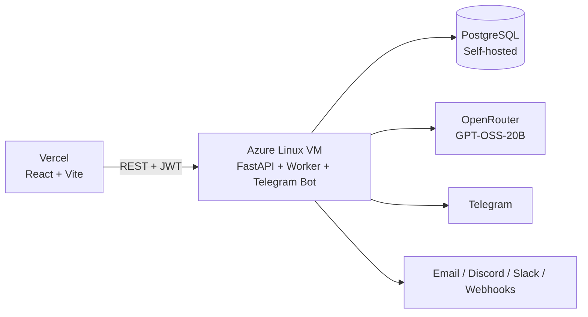

<div align="center">


</div>

<div align="center">

# 🔭 PulseWatch

### Self-hosted uptime monitoring with Telegram alerts, AI-explained incidents, and public status pages.

[](LICENSE)


</div>

<br/>

<div align="center">
  <a href="https://github.com/Robibiruk/PulseWatch">GitHub</a> ·
  <a href="https://t.me/iamrobiii">Telegram</a> ·
  <a href="https://www.linkedin.com/in/robel-biruk-5923101b5/">LinkedIn</a> ·
  <a href="https://pulsewatch-monitor.vercel.app">Live Demo</a> ·
  <a href="#quick-start">Quick Start</a>
</div>

<br/>

<div align="center">

## ✨ What is PulseWatch?

</div>


> PulseWatch is a **self-hosted full-stack uptime monitoring platform** for developers who want to know when their services break before users notice. It continuously probes your endpoints, tracks uptime history, detects repeated failures, automatically opens and resolves incidents, sends alerts through multiple channels, and provides a **public status page** you can share with users.
>
> PulseWatch also uses **OpenRouter-powered AI** to analyze the evidence collected during an incident and generate a concise, plain-English explanation of what may have happened.

<div align="center">

|           🔔 **Instant Alerts**           |          📊 **Live Dashboard**          |         🌐 **Public Status**         |                🤖 **AI Analysis**               |
| :---------------------------------------: | :-------------------------------------: | :----------------------------------: | :---------------------------------------------: |
| Telegram, Email, Discord, Slack, Webhooks | Real-time KPIs, uptime %, response time | Shareable status board with 3 themes |       OpenRouter-powered incident analysis      |
|     [Notifications](#-notifications) →    |        [Dashboard](#-features) →        |     [Status Pages](#-features) →     | [AI Explanations](#-ai-incident-explanations) → |

</div>

---

<div align="center">

## 🚀 Quick Start

</div>

### 1. Clone the repository

```bash
git clone https://github.com/Robibiruk/PulseWatch.git
cd PulseWatch
```

### 2. Backend

```bash
cd backend

python3 -m venv .venv
source .venv/bin/activate

pip install -r requirements.txt

cp .env.example .env
nano .env
```

At minimum, configure:

```env
DATABASE_URL=postgresql+asyncpg://...
SECRET_KEY=<long-random-secret>
CORS_ORIGINS=http://localhost:5173
```

Start FastAPI:

```bash
uvicorn main:app --reload --port 8000
```

The API runs at:

```text
http://localhost:8000
```

Interactive API documentation:

```text
http://localhost:8000/docs
```

### 3. Frontend

Open another terminal:

```bash
cd frontend
npm install
npm run dev
```

Open:

```text
http://localhost:5173
```

Register an account and add your first monitor.

---

<div align="center">

## 📸 See It in Action

</div>

<table>
  <tr>
    <td align="center">
      
      <br/>
      <b>Login</b><br/>
      <sub>JWT authentication + GitHub OAuth</sub>
    </td>
    <td align="center">
      
      <br/>
      <b>Dashboard</b><br/>
      <sub>Real-time KPIs + monitor fleet</sub>
    </td>
  </tr>
  <tr>
    <td align="center" colspan="2">
      
      <br/>
      <b>Public Status Page</b><br/>
      <sub>Auth-free shareable board with neon, light, and minimal themes</sub>
    </td>
  </tr>
</table>

---

<div align="center">

## ⚡ Features

</div>

<div align="center">

| Category                  | What you get                                                                                                        |
| :------------------------ | :------------------------------------------------------------------------------------------------------------------ |
| **HTTP Monitoring**       | HTTP/HTTPS checks, configurable intervals, timeouts, redirects, HTTP methods, authentication, and status-code rules |
| **Heartbeat Monitoring**  | Push-based monitoring for cron jobs, workers, and background services                                               |
| **SSL Monitoring**        | SSL/TLS error detection and certificate expiry monitoring                                                           |
| **Domain Monitoring**     | Domain expiry reminders                                                                                             |
| **Alerts**                | Telegram, Email, Discord, Slack, and generic JSON webhooks                                                          |
| **Dashboard**             | Real-time KPIs, uptime percentage, response times, filters, and monitor fleet                                       |
| **Incidents**             | Automatic incident creation, recovery detection, duration tracking, and severity information                        |
| **AI Analysis**           | OpenRouter-powered explanations based on actual monitoring evidence                                                 |
| **Status Pages**          | Public, authentication-free status pages with three visual themes                                                   |
| **Telegram Bot**          | `/status`, `/monitors`, `/incidents`, `/pause`, `/resume`, and `/help`                                              |
| **Authentication**        | Email/password, JWT authentication, bcrypt password hashing, and API tokens                                         |
| **Monitor Configuration** | Timeout, redirects, IP version, authentication, HTTP method, accepted status codes, and tags                        |

</div>

---

<div align="center">

## 🏗 Architecture

</div>


### Production architecture

PulseWatch currently runs as a **self-hosted production deployment on an Azure Linux VM**.

The React frontend is deployed separately and communicates with the FastAPI backend running on the Azure VM. The VM provides persistent compute for the API, monitoring worker, and Telegram bot.

PostgreSQL provides persistent production storage, while OpenRouter provides AI-powered incident analysis.



### Azure VM

The Azure VM is the persistent compute layer of the current production deployment.

It runs:

* FastAPI backend
* Continuous monitoring worker
* Telegram long-polling bot
* PostgreSQL database
* Incident detection and alert processing

This architecture avoids the sleeping-worker limitations of free-tier application hosting and allows PulseWatch to perform continuous monitoring.

### Monitoring pipeline

```text
Scheduler
    ↓
Find due monitors
    ↓
Claim monitor
    ↓
HTTP / HTTPS / Heartbeat probe
    ↓
Save check result
    ↓
Update monitor state
    ↓
Failure threshold reached?
    ├── No → schedule confirmation check
    └── Yes
          ↓
      Create incident
          ↓
      Analyze evidence with AI
          ↓
      Send notifications
```

### Claim-based worker design

The scheduler uses database-backed monitor claims.

For PostgreSQL deployments, due monitors are selected using row-level locking with `SKIP LOCKED`. A short lease prevents another worker from processing the same monitor simultaneously.

This makes the monitoring engine **safe to scale horizontally later**, while the current production deployment uses the Azure VM as its persistent worker environment.

---

<div align="center">

## 🚢 Production Deployment

</div>

### Current production stack

| Component             | Host                       | Purpose                                         |
| :-------------------- | :------------------------- | :---------------------------------------------- |
| **Frontend**          | Vercel                     | React + Vite web application                    |
| **Backend API**       | Azure Linux VM             | FastAPI REST API                                |
| **Monitoring Worker** | Azure Linux VM             | Continuous uptime checks and incident detection |
| **Telegram Bot**      | Azure Linux VM             | Long-polling commands and Telegram alerts       |
| **Database**          | PostgreSQL on Azure VM     | Persistent application and monitoring data      |
| **AI**                | OpenRouter                 | Incident explanation and analysis               |
| **Email**             | Resend                     | Email notifications                             |
| **Notifications**     | Discord / Slack / Webhooks | Additional alert channels                       |

### Azure deployment

The production backend is hosted on an **Azure Linux virtual machine**.

The VM provides a persistent environment for PulseWatch instead of relying on a serverless or sleeping application instance.

The production database is a **fresh PostgreSQL database** used by this deployment. PulseWatch does **not** use Neon for its current production database.

Production data includes:

* Users
* Monitors
* Historical checks
* Incidents
* AI explanations
* Telegram connections
* Notification settings
* Public status pages
* API tokens

### Frontend

The frontend is deployed separately and communicates with the Azure-hosted API through the configured `VITE_API_BASE` URL.

```env
VITE_API_BASE=https://your-api-domain
```

### Backend

The backend runs FastAPI together with the monitoring worker and Telegram bot.

A production process manager such as `systemd` should be used to keep the service running and automatically restart it if the process exits.

Example service architecture:

```text
Azure VM
├── PulseWatch FastAPI
├── PulseWatch Worker
├── PulseWatch Telegram Bot
└── PostgreSQL
```

---

<div align="center">

## 🤖 AI Incident Explanations

</div>

PulseWatch uses **OpenRouter** to analyze monitoring evidence when an incident is created.

### Current model

```text
openai/gpt-oss-20b
```

When a monitor reaches the configured failure threshold, PulseWatch sends evidence such as:

* Current HTTP status code
* Current error
* Recent HTTP status codes
* Failure pattern

The model then generates a concise explanation of the most likely cause.

Example evidence:

```text
Current HTTP status: 503
Current error: Service unavailable
Recent HTTP status codes: [200, 200, 503, 503, 503]
```

The AI can identify the important pattern:

```text
200 → 200 → 503 → 503 → 503
```

and explain that the service was previously responding normally before returning consecutive 503 responses.

### Important limitation

PulseWatch's AI does **not** have access to the monitored server's internal logs, CPU usage, memory usage, database state, or infrastructure configuration.

Therefore, it should not claim to know the exact root cause when the evidence does not support it.

For example, the AI may identify:

* Application failure
* Resource exhaustion
* Dependency failure
* Temporary service unavailability

as possible causes, but it should clearly distinguish these from directly observed evidence.

### Graceful fallback

If OpenRouter is unavailable, incorrectly configured, or no API key is provided, PulseWatch falls back to deterministic rule-based explanations.

Common fallback cases include:

* HTTP 500
* HTTP 502
* HTTP 503
* HTTP 504
* Connection failures
* DNS failures
* Request timeouts

This means incident detection and alerting continue even if the AI service is unavailable.

---

<div align="center">

## 🔧 Environment Variables

</div>

### Core

| Variable       | Default                  | Description                                    |
| :------------- | :----------------------- | :--------------------------------------------- |
| `DATABASE_URL` | *(required)*             | PostgreSQL async URL or SQLite development URL |
| `SECRET_KEY`   | `dev-insecure-change-me` | JWT signing secret                             |
| `CORS_ORIGINS` | `http://localhost:5173`  | Comma-separated allowed browser origins        |

### Worker / Scheduler

| Variable             | Default | Description                                              |
| :------------------- | ------: | :------------------------------------------------------- |
| `POLL_INTERVAL`      |    `15` | Scheduler tick interval in seconds                       |
| `WORKER_CONCURRENCY` |    `20` | Maximum concurrent monitor checks                        |
| `NO_WORKER`          | `false` | Disable the built-in worker                              |
| `FAILURE_THRESHOLD`  |     `3` | Consecutive failures required before opening an incident |
| `CONFIRMATION_DELAY` |    `10` | Delay before confirmation/recovery checks                |

### Telegram

| Variable             | Default | Description                       |
| :------------------- | :------ | :-------------------------------- |
| `TELEGRAM_BOT_TOKEN` | `""`    | Telegram bot token from BotFather |
| `NO_TELEGRAM_BOT`    | `false` | Disable the Telegram bot          |

### Email

| Variable           | Default                 | Description             |
| :----------------- | :---------------------- | :---------------------- |
| `RESEND_API_KEY`   | `""`                    | Resend API key          |
| `ALERT_FROM_EMAIL` | `alerts@yourdomain.com` | Verified sender address |

### AI

| Variable             | Default              | Description                      |
| :------------------- | :------------------- | :------------------------------- |
| `OPENROUTER_API_KEY` | `""`                 | OpenRouter API key               |
| `OPENROUTER_MODEL`   | `openai/gpt-oss-20b` | Model used for incident analysis |

### Frontend

| Variable        | Default                 | Description          |
| :-------------- | :---------------------- | :------------------- |
| `VITE_API_BASE` | `http://localhost:8000` | Backend API base URL |

> Full configuration is available in [`backend/.env.example`](backend/.env.example).

---

<div align="center">

## 📡 API Reference

</div>

All authenticated routes require:

```http
Authorization: Bearer <jwt>
```

| Method   | Path                             | Description          |
| :------- | :------------------------------- | :------------------- |
| `POST`   | `/auth/register`                 | Register account     |
| `POST`   | `/auth/token`                    | Login and obtain JWT |
| `GET`    | `/auth/me`                       | Get current user     |
| `GET`    | `/monitors`                      | List monitors        |
| `POST`   | `/monitors`                      | Create monitor       |
| `PATCH`  | `/monitors/:id`                  | Update monitor       |
| `DELETE` | `/monitors/:id`                  | Delete monitor       |
| `GET`    | `/monitors/summary`              | Monitor fleet KPIs   |
| `GET`    | `/monitors/incidents`            | Recent incidents     |
| `GET`    | `/status/:userId`                | Public status board  |
| `POST`   | `/api/heartbeat/:token`          | Send heartbeat       |
| `GET`    | `/status/health`                 | API health check     |
| `POST`   | `/api/platform/tokens`           | Create API token     |
| `POST`   | `/api/platform/account/password` | Change password      |

Interactive Swagger documentation:

```text
http://localhost:8000/docs
```

---

<div align="center">

## 🤖 Telegram Bot

</div>

PulseWatch's Telegram bot uses **long-polling**, so no webhook configuration is required.

| Command          | Description                                 |
| :--------------- | :------------------------------------------ |
| `/start <token>` | Connect Telegram to your PulseWatch account |
| `/status`        | Show monitor status                         |
| `/monitors`      | List monitors                               |
| `/incidents`     | Show recent incidents                       |
| `/pause`         | Pause alerts                                |
| `/resume`        | Resume alerts                               |
| `/help`          | Show available commands                     |

### Connecting Telegram

```text
Dashboard
    ↓
Settings
    ↓
Connect Telegram
    ↓
Open Telegram deep link
    ↓
Press Start
    ↓
Account linked
```

---

<div align="center">

## 📬 Notifications

</div>

PulseWatch can send incident and recovery notifications through:

* **Telegram**
* **Email**
* **Discord**
* **Slack**
* **Generic JSON webhooks**

Channels are configured per user.

When a monitor reaches the failure threshold:

```text
Monitor failure
      ↓
Failure threshold reached
      ↓
Incident created
      ↓
AI explanation generated
      ↓
Notification dispatched
```

When the monitor recovers, PulseWatch resolves the incident and sends a recovery notification.

---

<div align="center">

## 🧪 Monitor Types

</div>

### HTTP / HTTPS

HTTP monitors support:

* Configurable check interval
* Request timeout
* HTTP methods
* Redirect following
* IPv4 / IPv6 / automatic selection
* Basic authentication
* Bearer authentication
* Accepted status-code groups
* SSL/TLS checks
* SSL certificate expiry reminders
* Domain expiry reminders
* Response-time tracking

### Heartbeat

Heartbeat monitoring is designed for services that cannot be continuously probed through a normal HTTP endpoint.

Your application sends a request to:

```text
POST /api/heartbeat/:token
```

If PulseWatch does not receive a heartbeat within the expected interval, the monitor is considered down and an incident can be opened.

This is useful for:

* Cron jobs
* Background workers
* Scheduled scripts
* Data pipelines
* Internal services

---

<div align="center">

## ❤️ Reliability

</div>

PulseWatch uses a failure threshold to reduce false alarms.

With the default configuration:

```text
Failure #1 → no incident
Failure #2 → no incident
Failure #3 → incident opened
```

A temporary one-request failure therefore does not immediately trigger an outage alert.

When the service starts responding again:

```text
Service recovers
      ↓
Incident resolved
      ↓
Recovery duration calculated
      ↓
Recovery notification sent
```

---

<div align="center">

## 🔐 Production Security Checklist

</div>

Before exposing a deployment publicly:

* [ ] Set `SECRET_KEY` to a long random value
* [ ] Set `CORS_ORIGINS` to the real frontend domain
* [ ] Never use `CORS_ORIGINS=*` in production
* [ ] Use PostgreSQL for production
* [ ] Keep `.env` out of Git
* [ ] Rotate API keys if they are accidentally exposed
* [ ] Keep `TELEGRAM_BOT_TOKEN` private
* [ ] Keep `OPENROUTER_API_KEY` private
* [ ] Put the API behind HTTPS
* [ ] Use a reverse proxy such as Nginx or Caddy
* [ ] Add rate limiting to authentication and public endpoints
* [ ] Keep the Azure VM and system packages updated
* [ ] Configure automatic service restart with `systemd`
* [ ] Restrict unnecessary Azure VM inbound ports

Generate a strong secret with:

```bash
python3 -c "import secrets; print(secrets.token_urlsafe(48))"
```

---

<div align="center">

## 📁 Project Layout

</div>

```text
PulseWatch/
├── backend/
│   ├── main.py              # FastAPI app + lifespan
│   ├── worker.py            # Monitoring scheduler and incident engine
│   ├── checker.py           # HTTP, SSL and domain checks
│   ├── telegram_bot.py      # Telegram bot + account linking
│   ├── notifications.py     # Alert dispatch and notification formatting
│   ├── emailer.py           # HTML email templates
│   ├── ai_explain.py        # OpenRouter AI incident analysis
│   ├── models.py            # SQLAlchemy ORM models
│   ├── schemas.py           # Pydantic schemas
│   ├── database.py          # Database engine and initialization
│   ├── config.py            # Application configuration
│   ├── requirements.txt      # Python dependencies
│   └── routers/
│       ├── auth.py
│       ├── monitors.py
│       ├── status.py
│       ├── telegram.py
│       ├── heartbeat.py
│       ├── statuspage.py
│       ├── notifications.py
│       └── platform.py
│
├── frontend/
│   ├── src/
│   │   ├── App.tsx
│   │   ├── api.ts
│   │   ├── auth.tsx
│   │   ├── components/
│   │   └── pages/
│   └── vite.config.ts
│
├── docs-site/
│   ├── docs/
│   └── blog/
│
├── docs/
│   ├── diagrams/
│   └── screenshots/
│
└── README.md
```

---

<div align="center">

## 🗺 Roadmap

</div>

### Reliability

* Alembic migrations
* Durable job queue
* Second-region confirmation
* Rate limiting
* Better worker supervision
* Monitoring worker health

### Features

* Incident acknowledgement
* Maintenance windows
* Escalation policies
* Monitor tags and groups
* Longer-term SLA charts
* Team accounts and RBAC
* More notification integrations

### Infrastructure

* Docker / Docker Compose deployment
* Automated Azure deployment
* Automated PostgreSQL backups
* Multi-region monitoring
* Distributed workers

### Scaling

```text
Current
│
├── Azure VM
├── PostgreSQL
├── 1 monitoring worker
└── Continuous monitoring
        │
        ▼
Next
│
├── Durable queue
├── Multiple workers
└── Better failure isolation
        │
        ▼
Future
│
├── Multiple regions
├── Distributed workers
└── Large-scale monitoring
```

---

<div align="center">

## 👤 Built by

</div>

<div align="center">

**[Robel Biruk](https://www.linkedin.com/in/robel-biruk-5923101b5/)** — [@Robibiruk](https://github.com/Robibiruk)

</div>

---

<div align="center">

## 📄 License

</div>

<div align="center">

[](LICENSE)

MIT License — see [`LICENSE`](LICENSE) for details.

<br/>

**[⬆ Back to top](#-pulsewatch)**

</div>
