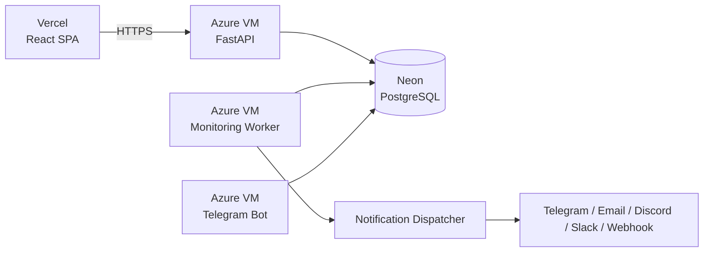

<div align="center">


# 🔭 PulseWatch

### Self-hosted uptime monitoring with Telegram alerts and AI-explained incidents.

[](LICENSE)


[GitHub](https://github.com/Robibiruk/PulseWatch) · [Telegram](https://t.me/iamrobiii) · [LinkedIn](https://www.linkedin.com/in/robel-biruk-5923101b5/) · [Live Demo](https://pulsewatch-monitor.vercel.app)

</div>

---

## ✨ What is PulseWatch?


PulseWatch is a **full-stack, self-hosted uptime monitoring platform** for developers who want to know when their services break before users notice.

It checks endpoints on a schedule, tracks uptime and response time, automatically opens and resolves incidents, sends alerts through multiple channels, provides public status pages, and uses AI to explain incidents in plain English.

### Why self-hosted?

PulseWatch runs its always-on backend on an **Azure Virtual Machine** instead of relying on a sleeping web-service tier. The VM continuously runs the API, monitoring worker, and Telegram bot.

| 🔔 Alerts | 📊 Monitoring | 🌐 Status Pages | 🤖 AI |
|:---:|:---:|:---:|:---:|
| Telegram, Email, Discord, Slack, Webhooks | HTTP/HTTPS + Heartbeat | Shareable, auth-free pages | OpenRouter incident explanations |

---

## 🚀 Quick Start

### Backend

```bash
git clone https://github.com/Robibiruk/PulseWatch.git
cd PulseWatch/backend

python -m venv .venv
source .venv/bin/activate       # Windows: .venv\Scripts\activate
pip install -r requirements.txt

cp .env.example .env
# Set DATABASE_URL and SECRET_KEY in .env

uvicorn main:app --reload --port 8000
```

API: `http://localhost:8000`  
Swagger: `http://localhost:8000/docs`

### Frontend

```bash
cd frontend
npm install
npm run dev
```

Open `http://localhost:5173` and create an account.

---

## ⚡ Features

| Category | What you get |
|:---|:---|
| **Monitors** | HTTP/HTTPS, heartbeat push checks, 1–30 min intervals, SSL and domain expiry checks |
| **Checks** | Timeout, redirects, IPv4/IPv6, GET/HEAD/POST, basic/bearer auth, status-code rules |
| **Incidents** | Automatic open/resolve, failure threshold, recovery confirmation, duration and severity |
| **Alerts** | Telegram, Email via Resend, Discord, Slack, generic JSON webhooks |
| **Dashboard** | Fleet KPIs, uptime %, response time, filters and monitor details |
| **Status Pages** | Public, auth-free pages with neon, light and minimal themes |
| **Telegram Bot** | `/status`, `/monitors`, `/incidents`, `/pause`, `/resume`, `/help` |
| **Authentication** | Email/password, JWT, bcrypt and API tokens |
| **AI** | OpenRouter-powered plain-English incident explanations |

---

## 🏗 Architecture


### Production



The production stack is:

- **Azure VM** — self-hosted VPS running FastAPI, the monitoring worker, and Telegram long-polling bot.
- **Neon** — managed PostgreSQL database.
- **Vercel** — React/Vite frontend.
- **OpenRouter** — AI incident explanations.
- **Resend** — email notifications.

The worker uses `SELECT FOR UPDATE SKIP LOCKED` to atomically claim due monitors, preventing duplicate checks and alerts when multiple workers are active.

---

## 🚢 Production Deployment

PulseWatch uses an **Ubuntu 24.04 LTS Azure Virtual Machine** as its always-on production server.

| Service | Host | Responsibility |
|:---|:---|:---|
| **API** | Azure VM | FastAPI application and REST API |
| **Worker** | Azure VM | Continuous monitor scheduling and checks |
| **Telegram Bot** | Azure VM | Long-polling bot and account linking |
| **Database** | Neon | PostgreSQL persistence |
| **Frontend** | Vercel | React SPA |
| **Docs** | Vercel | Docusaurus documentation |

### Required production configuration

```env
DATABASE_URL=postgresql+asyncpg://...
SECRET_KEY=<long-random-secret>
CORS_ORIGINS=https://your-frontend-domain
PUBLIC_BASE_URL=https://your-api-domain
TELEGRAM_BOT_TOKEN=<bot-token>
OPENROUTER_API_KEY=<openrouter-key>
RESEND_API_KEY=<resend-key>
```

The Azure VM should have the required NSG/network rules configured, expose only necessary ports, and run the API, worker, and bot under a process manager or service supervisor so they restart after crashes and reboots.

> **Why Azure VM?** Monitoring requires a continuously running scheduler, and the Telegram bot uses long-polling. A persistent VPS avoids the sleep and cold-start behavior common with free web-service hosting.

---

## 🛠 Tech Stack

| Layer | Technology |
|:---|:---|
| **Backend** | Python 3.12, FastAPI, SQLAlchemy 2.0 async, Pydantic v2 |
| **Frontend** | React 18, Vite, TypeScript, React Router v6 |
| **Database** | PostgreSQL / Neon, SQLite for development |
| **Auth** | JWT, python-jose, bcrypt, API tokens |
| **Notifications** | Telegram Bot API, Resend, Discord/Slack webhooks |
| **AI** | OpenRouter (`openai/gpt-oss-20b:free`) |
| **Infrastructure** | Azure VM, Vercel, Neon |

---

## 📁 Project Layout

```text
PulseWatch/
├── backend/
│   ├── main.py              # FastAPI app + lifespan
│   ├── worker.py            # Monitor scheduler + claim locking
│   ├── checker.py           # HTTP, SSL and domain checks
│   ├── telegram_bot.py      # Telegram bot + account linking
│   ├── notifications.py     # Multi-channel alert dispatch
│   ├── emailer.py           # HTML email templates
│   ├── ai_explain.py        # AI incident explanations
│   ├── models.py            # SQLAlchemy ORM models
│   ├── schemas.py           # Pydantic schemas
│   ├── database.py          # Database engine and migrations
│   ├── config.py            # Application configuration
│   └── routers/             # API route modules
├── frontend/
│   ├── src/
│   │   ├── App.tsx
│   │   ├── api.ts
│   │   ├── auth.tsx
│   │   ├── components/
│   │   └── pages/
│   └── vite.config.ts
├── docs-site/               # Docusaurus documentation
└── README.md
```

---

## 🔧 Environment Variables

### Core

| Variable | Default | Description |
|:---|:---|:---|
| `DATABASE_URL` | required | PostgreSQL async URL or SQLite development URL |
| `SECRET_KEY` | `dev-insecure-change-me` | JWT signing secret |
| `CORS_ORIGINS` | `http://localhost:5173` | Allowed frontend origins |
| `PUBLIC_BASE_URL` | `http://localhost:8000` | Public API URL for generated links |

### Worker

| Variable | Default | Description |
|:---|:---|:---|
| `POLL_INTERVAL` | `15` | Scheduler tick in seconds |
| `WORKER_CONCURRENCY` | `20` | Maximum concurrent checks |
| `NO_WORKER` | `false` | Disable built-in worker |
| `FAILURE_THRESHOLD` | `3` | Failures before opening an incident |
| `CONFIRMATION_DELAY` | `10` | Recovery confirmation delay |

### Integrations

| Variable | Description |
|:---|:---|
| `TELEGRAM_BOT_TOKEN` | Telegram bot token |
| `NO_TELEGRAM_BOT` | Disable Telegram bot when `true` |
| `RESEND_API_KEY` | Resend email API key |
| `ALERT_FROM_EMAIL` | Verified sender address |
| `OPENROUTER_API_KEY` | OpenRouter API key |
| `OPENROUTER_MODEL` | AI model used for explanations |
| `VITE_API_BASE` | Frontend API base URL |

> See [`backend/.env.example`](backend/.env.example) for the complete configuration.

---

## 📡 API Reference

Authenticated routes require `Authorization: Bearer <jwt>`.

| Method | Path | Description |
|:---|:---|:---|
| `POST` | `/auth/register` | Register |
| `POST` | `/auth/token` | Login |
| `GET` | `/auth/me` | Current user |
| `GET` | `/monitors` | List monitors |
| `POST` | `/monitors` | Create monitor |
| `PATCH` | `/monitors/:id` | Update monitor |
| `DELETE` | `/monitors/:id` | Delete monitor |
| `GET` | `/monitors/summary` | Fleet KPIs |
| `GET` | `/monitors/incidents` | Recent incidents |
| `GET` | `/status/:userId` | Public status page |
| `POST` | `/api/heartbeat/:token` | Heartbeat ping |
| `GET` | `/status/health` | Health check |
| `POST` | `/api/platform/tokens` | Create API token |
| `POST` | `/api/platform/account/password` | Change password |

Interactive Swagger documentation is available at `/docs`.

---

## 🤖 Telegram Bot

The bot uses **long-polling**, so no webhook setup is required.

| Command | Description |
|:---|:---|
| `/start <token>` | Link Telegram to your account |
| `/status` | Show monitor states |
| `/monitors` | List monitors |
| `/incidents` | Show recent incidents |
| `/pause` | Pause alerts |
| `/resume` | Resume alerts |
| `/help` | Show commands |

**Linking:** Dashboard → Settings → Connect Telegram → Telegram → Start.

---

## 🔐 Production Security Checklist

- [ ] Use a long random `SECRET_KEY`.
- [ ] Set `CORS_ORIGINS` to your real frontend domain. Never use `*` in production.
- [ ] Use Neon/PostgreSQL in production.
- [ ] Keep API keys and bot tokens out of Git.
- [ ] Configure Azure NSG rules to expose only required ports.
- [ ] Put the API behind HTTPS and a reverse proxy.
- [ ] Add rate limiting to authentication and heartbeat endpoints.
- [ ] Restrict SSH access to the Azure VM where practical.
- [ ] Run API, worker, and bot under a process supervisor.

---

## 🗺 Roadmap

### Reliability
- Alembic migrations
- Durable Redis/RQ or ARQ job queue
- Second-region confirmation
- Rate limiting

### Features
- Incident acknowledgement and assignment
- Maintenance windows
- Escalation policies
- Monitor tags and groups
- 30–90 day SLA charts
- Docker Compose one-command self-hosting
- Team accounts and RBAC

### Scaling
- **MVP:** ≤100 monitors, 1 worker, 1-minute checks
- **Beta:** ~1k monitors, Redis queue, multiple workers
- **Production:** 10k+ monitors, distributed workers across regions

---

<div align="center">

## 👤 Built by

**[Robel Biruk](https://www.linkedin.com/in/robel-biruk-5923101b5/)** — [@Robibiruk](https://github.com/Robibiruk)

## 📄 License

[](LICENSE)

MIT License — see [`LICENSE`](LICENSE) for details.

**[⬆ Back to top](#-pulsewatch)**

</div>
