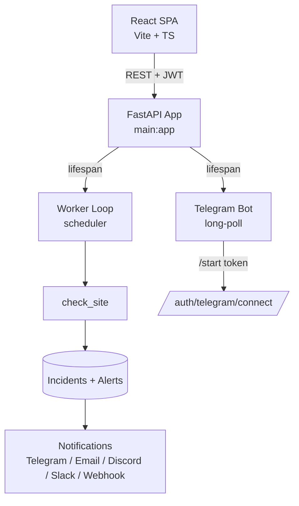
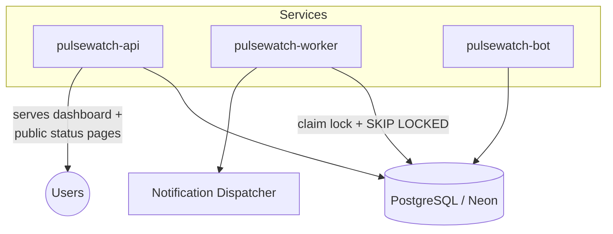
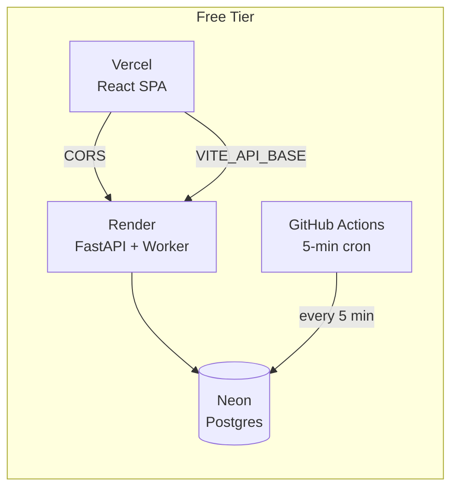

<div align="center">


</div>

<div align="center">

# 🔭 PulseWatch

### Self-hosted uptime monitoring with Telegram alerts and AI-explained incidents.

[](LICENSE)


</div>

<br/>

<div align="center">
  <a href="https://github.com/Robibiruk/PulseWatch">GitHub</a> ·
  <a href="https://t.me/iamrobiii">Telegram</a> ·
  <a href="https://www.linkedin.com/in/robel-biruk-5923101b5/">LinkedIn</a> ·
  <a href="https://pulsewatch-monitor.vercel.app">Live Demo</a> ·
  <a href="#quick-start">Quick Start</a>
</div>

<br/>

<div align="center">

## ✨ What is PulseWatch?

</div>


> PulseWatch is a **full-stack monitoring platform** for developers who want to know when their services break — before users notice. It probes your endpoints every minute, tracks uptime history, opens incidents automatically on repeated failures, sends alerts to Telegram / Email / Discord / Slack / Webhooks, and gives you a **public status page** to share with your users. AI-powered incident explanations tell you *why* something broke in plain English.

<div align="center">

| 🔔 **Instant Alerts** | 📊 **Live Dashboard** | 🌐 **Public Status** | 🤖 **AI Explanations** |
|:---:|:---:|:---:|:---:|
| Telegram, Email, Discord, Slack, Webhooks | Real-time KPIs, uptime %, response time | Shareable status board with 3 themes | OpenRouter-powered plain-English root causes |
| [Dashboard](#dashboard) → | [Status Page](#public-status-page) → | [Alerts](#notifications) → | [AI](#ai-incident-explanations) → |

</div>

---

<div align="center">

## 🚀 Quick Start

</div>

### 1. Backend (FastAPI)

```bash
# Clone the repo
git clone https://github.com/Robibiruk/PulseWatch.git
cd PulseWatch

# Python backend
cd backend
python -m venv .venv
.venv/Scripts/activate          # macOS/Linux: source .venv/bin/activate
pip install -r requirements.txt

# Create .env (or export vars)
cp .env.example .env
# Edit .env — set DATABASE_URL and SECRET_KEY at minimum

uvicorn main:app --reload --port 8000
```

The API runs at `http://localhost:8000` — interactive docs at `/docs`.

### 2. Frontend (React + Vite)

```bash
cd frontend
npm install
npm run dev
```

Open `http://localhost:5173`, register an account, add your first monitor.

### 3. Production

```bash
# One-command local startup (both services)
./start-all.bat          # Windows
npm run dev:all          # cross-platform
```

See [Production Deployment](#production-deployment) for the full guide (Render + Vercel + Neon + GitHub Actions).

---

<div align="center">

## 📸 See It in Action

</div>

<table>
  <tr>
    <td align="center">
      
      <br/>
      <b>Login</b><br/>
      <sub>JWT auth + GitHub OAuth</sub>
    </td>
    <td align="center">
      
      <br/>
      <b>Dashboard</b><br/>
      <sub>Real-time KPIs + monitor fleet</sub>
    </td>
  </tr>
  <tr>
    <td align="center" colspan="2">
      
      <br/>
      <b>Public Status Page</b><br/>
      <sub>Auth-free shareable board with 3 themes (neon / light / minimal)</sub>
    </td>
  </tr>
</table>

---

<div align="center">

## ⚡ Features

</div>

<div align="center">

| Category | What you get |
|:---|:---|
| **Monitors** | HTTP/HTTPS, heartbeat (push), configurable interval (1–30 min), SSL checks, domain expiry |
| **Alerts** | Telegram, Email (Resend), Discord webhook, Slack webhook, generic JSON webhook |
| **Dashboard** | Real-time KPIs, uptime %, response time, monitor fleet with filters |
| **Incidents** | Auto open/resolve, duration tracking, severity, AI root-cause explanations |
| **Status Pages** | 3 themes (neon / light / minimal), auth-free, shareable URLs |
| **Bot** | Telegram long-polling: `/status`, `/incidents`, `/pause`, `/resume` |
| **Auth** | Email/password + JWT, bcrypt, API tokens |
| **Config** | Per-monitor: timeout, redirects, IP version, auth (basic/bearer), status codes |

</div>

---

<div align="center">

## 🏗 Architecture

</div>


**Dev (single process):** The FastAPI lifespan starts the worker loop and Telegram bot in-process.



**Prod (recommended): separate services.** Render runs the API + worker + bot against one Postgres. The worker uses `SELECT FOR UPDATE SKIP LOCKED` so 2+ replicas safely share monitors with zero duplicate checks or alerts.



**Claim-lock state machine:** the scheduler atomically claims each due monitor before probing — if a worker crashes, its lease expires and another picks up. No duplicates, no false alerts.

---

<div align="center">

## 🚢 Production Deployment

</div>

PulseWatch is designed for **free-tier hosting**: Neon (Postgres) + Render (API) + Vercel (frontend) + GitHub Actions (always-on worker cron).



### Deploy checklist

| Service | Host | What to set |
|:---|:---|:---|
| **Database** | [Neon](https://neon.tech) | Create project → copy pooled connection string as `DATABASE_URL` |
| **API** | [Render](https://render.com) | Web Service → root `backend` → start: `bash start.sh` |
| **Frontend** | [Vercel](https://vercel.com) | Project → root `frontend` → env: `VITE_API_BASE=<render URL>` |
| **Docs** | Vercel | Project → root `docs-site` (Docusaurus) |
| **Worker cron** | GitHub Actions | `monitor.yml` runs every 5 min → secrets: `DATABASE_URL`, `SECRET_KEY` |

**Critical env vars on Render:**
- `CORS_ORIGINS` → your Vercel frontend URL (comma-separated)
- `PUBLIC_BASE_URL` → your Render API URL (for Telegram deep links)
- `SECRET_KEY` → long random string

---

<div align="center">

## 🛠 Tech Stack

</div>

<div align="center">

| Layer | Technology |
|:---|:---|
| **Backend** | Python 3.12, FastAPI, SQLAlchemy 2.0 (async), Pydantic v2 |
| **Frontend** | React 18, Vite, TypeScript, React Router v6 |
| **Database** | PostgreSQL (Neon) or SQLite (dev) |
| **Auth** | JWT (python-jose), bcrypt, API tokens |
| **Notifications** | Telegram Bot API, Resend (email), Discord/Slack webhooks |
| **AI** | OpenRouter (GPT-OSS-20b:free) for incident explanations |
| **Deployment** | Render (API), Vercel (frontend), GitHub Actions (worker cron) |

</div>

---

<div align="center">

## 📁 Project Layout

</div>

```
PulseWatch/
├── backend/
│   ├── main.py              # FastAPI app + lifespan (worker + bot)
│   ├── worker.py            # Scheduler — claim-lock + SKIP LOCKED
│   ├── checker.py           # HTTP probe, SSL, domain checks
│   ├── telegram_bot.py      # Long-polling bot + account linking
│   ├── notifications.py     # Multi-channel alert dispatch
│   ├── emailer.py           # Branded HTML email templates
│   ├── ai_explain.py        # OpenRouter AI incident explanations
│   ├── models.py            # SQLAlchemy 2.0 async ORM
│   ├── schemas.py           # Pydantic request/response schemas
│   ├── database.py          # Engine + additive column migrations
│   ├── config.py            # pydantic-settings config
│   ├── requirements.txt     # Python dependencies
│   ├── render.yaml          # Render deployment config
│   └── routers/             # auth, monitors, status, telegram,
│                            #   heartbeat, statuspage, notifications, platform
├── frontend/
│   ├── src/
│   │   ├── App.tsx          # React Router routes
│   │   ├── api.ts           # API client (fetch + JWT)
│   │   ├── auth.tsx         # Auth context (login/register/logout)
│   │   ├── components/      # Layout, Icon, MonitorEditor, Wizard
│   │   └── pages/           # Landing, Dashboard, Settings, Profile,
│   │                        #   MonitorDetail, Incidents, PublicStatus
│   └── vite.config.ts
├── docs-site/               # Docusaurus documentation site
│   ├── docs/                # MDX documentation pages
│   └── blog/                # Changelog + technical posts
└── README.md
```

---

<div align="center">

## 🔧 Environment Variables

</div>

### Core

| Variable | Default | Description |
|:---|:---|:---|
| `DATABASE_URL` | *(required)* | SQLAlchemy async URL — `postgresql+asyncpg://...` or `sqlite+aiosqlite:///./pulsewatch.db` |
| `SECRET_KEY` | `dev-insecure-change-me` | JWT signing secret — **set a long random value in production** |
| `CORS_ORIGINS` | `http://localhost:5173` | Comma-separated allowed browser origins |

### Worker / Scheduler

| Variable | Default | Description |
|:---|:---|:---|
| `POLL_INTERVAL` | `15` | Base scheduler tick (seconds) |
| `WORKER_CONCURRENCY` | `20` | Max concurrent checks |
| `NO_WORKER` | `false` | Set `true` to disable the built-in scheduler (when GitHub Actions owns checks) |
| `FAILURE_THRESHOLD` | `3` | Consecutive failures before incident opens |
| `CONFIRMATION_DELAY` | `10` | Seconds to confirm recovery |

### Telegram

| Variable | Default | Description |
|:---|:---|:---|
| `TELEGRAM_BOT_TOKEN` | `""` | Bot token from @BotFather — enables bot + Telegram alerts |
| `NO_TELEGRAM_BOT` | `false` | Set `true` to disable the bot poller |

### Email (Resend)

| Variable | Default | Description |
|:---|:---|:---|
| `RESEND_API_KEY` | `""` | Resend API key |
| `ALERT_FROM_EMAIL` | `alerts@yourdomain.com` | From address (must be verified in Resend) |

### AI Explanations

| Variable | Default | Description |
|:---|:---|:---|
| `OPENROUTER_API_KEY` | `""` | OpenRouter key for AI incident explanations |
| `OPENROUTER_MODEL` | `openai/gpt-oss-20b:free` | Model used |

### Frontend

| Variable | Default | Description |
|:---|:---|:---|
| `VITE_API_BASE` | `http://localhost:8000` | Backend base URL the SPA calls |

> Full `.env.example` at [`backend/.env.example`](backend/.env.example)

---

<div align="center">

## 📡 API Reference (summary)

</div>

All authenticated routes require `Authorization: Bearer <jwt>`.

| Method | Path | Description |
|:---|:---|:---|
| `POST` | `/auth/register` | Register account |
| `POST` | `/auth/token` | Login → `{access_token}` |
| `GET` | `/auth/me` | Current user |
| `GET` | `/monitors` | List monitors |
| `POST` | `/monitors` | Create monitor |
| `PATCH` | `/monitors/:id` | Update monitor |
| `DELETE` | `/monitors/:id` | Delete monitor |
| `GET` | `/monitors/summary` | Fleet KPIs |
| `GET` | `/monitors/incidents` | Recent incidents |
| `GET` | `/status/:userId` | Public status board (no auth) |
| `POST` | `/api/heartbeat/:token` | Push heartbeat ping |
| `GET` | `/status/health` | Public health check |
| `POST` | `/api/platform/tokens` | Create API token |
| `POST` | `/api/platform/account/password` | Change password |

> Interactive Swagger docs at `http://localhost:8000/docs` when the backend is running.

---

<div align="center">

## 🤖 Telegram Bot

</div>

The bot (`telegram_bot.py`) runs via **long-polling** — no webhook setup needed. It clears any leftover webhook on startup and responds to:

| Command | What it does |
|:---|:---|
| `/start <token>` | Links your Telegram chat to your PulseWatch account |
| `/status` | Shows your monitors with up/down state |
| `/monitors` | Lists monitors with URL + check interval |
| `/incidents` | Recent outages and recoveries |
| `/pause` | Pauses all alerts |
| `/resume` | Resumes alerts |
| `/help` | Lists commands |

**Linking flow:** Dashboard → Settings → Connect Telegram → opens `t.me/<BotUsername>?start=<token>` → press Start in Telegram → account linked.

---

<div align="center">

## 📬 Notifications

</div>

When a monitor goes down (or recovers), PulseWatch dispatches to every **enabled channel** for that user:

- **Telegram** — to your linked chat (instant)
- **Email** — branded HTML via Resend (incident + resolution + signup + checkin digests)
- **Discord** — JSON webhook with formatted message
- **Slack** — incoming webhook
- **Generic webhook** — JSON envelope (Zapier/Make/custom)

Channel enablement is per-user (`Settings → Alert Channels`). Users can pause all alerts globally.

---

<div align="center">

## 🧪 Monitor Types

</div>

### HTTP / HTTPS

The core monitor. Configurable: interval, timeout, redirects, IP version (auto/IPv4/IPv6), HTTP method (GET/HEAD/POST), auth (basic/bearer), status-code buckets (2xx/3xx), SSL checks, domain expiry reminders.

### Heartbeat (Push)

Your service pings a unique token URL (`POST /api/heartbeat/:token`) on a schedule. If no ping arrives within the interval, PulseWatch opens a "down" incident. Perfect for cron jobs, workers, and background tasks with no public HTTP endpoint.

---

<div align="center">

## 🔐 Production Security Checklist

</div>

- [ ] Set `SECRET_KEY` to a long random value (generate: `python -c "import secrets; print(secrets.token_urlsafe(48))"`)
- [ ] Set `CORS_ORIGINS` to your real frontend domain(s) — never `*` in production
- [ ] Use Postgres (Neon) in production — SQLite is dev-only
- [ ] Rotate `TELEGRAM_BOT_TOKEN` and `RESEND_API_KEY` via secret store, not committed files
- [ ] Put the API behind a reverse proxy with rate limiting for `/auth/token` and `/api/heartbeat/:token`

---

<div align="center">

## 🗺 Roadmap

</div>

### Reliability (highest priority)
- Alembic migrations — replace additive column migrations
- Durable job queue (Redis/RQ or ARQ) — survive worker restarts, scale past ~1k monitors
- Second-region confirmation — re-check down signals before alerting
- Rate limiting on auth and heartbeat endpoints

### Features
- Incident acknowledgement + assignment
- Maintenance windows — scheduled alert pauses
- Escalation policies — notify a second channel after N minutes unacked
- Monitor tags / groups
- 30–90 day SLA charts
- Docker / docker-compose one-command self-host
- Team accounts + RBAC

### Scaling
- **MVP:** ≤100 monitors, 1 worker, 1-min checks
- **Beta:** ~1k monitors, Redis queue, multiple worker replicas (claim-lock safe)
- **Production:** 10k+ monitors, distributed workers across regions

---

<div align="center">

## 👤 Built by

</div>

<div align="center">

**[Robel Biruk](https://www.linkedin.com/in/robel-biruk-5923101b5/)** — [@Robibiruk](https://github.com/Robibiruk)

</div>

---

<div align="center">

## 📄 License

</div>

<div align="center">

[](LICENSE)

MIT License — see [`LICENSE`](LICENSE) for details.

<br/>

**[⬆ Back to top](#-pulsewatch)**
</div>
