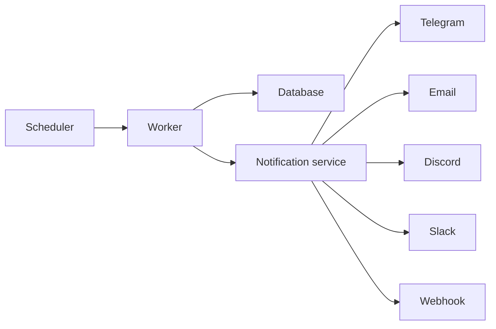

# Architecture

PulseWatch is built around a small, focused pipeline: scheduling checks, executing requests, storing results, and emitting alerts.

## System overview

## Components

- **Scheduler** – determines when each monitor should be checked
- **Worker** – runs HTTP/heartbeat checks, handles retries, records results
- **Database** – stores monitors, checks, incidents, and status page data
- **Notification service** – formats and routes alerts to external channels
- **Public status pages** – render uptime and incident history for visitors

## Data model highlights

- `monitors` – monitor definitions, intervals, and status
- `checks` – individual request outcomes with timing and status codes
- `incidents` – failure timelines, retries, severity, and resolution state
- `notifications` – channel-specific delivery metadata and failures
- `status_pages` – public-facing page configuration and branding

## Background jobs

Background workers execute checks and process notification delivery. This design keeps the API surface small while allowing horizontal scaling for high check volumes.
