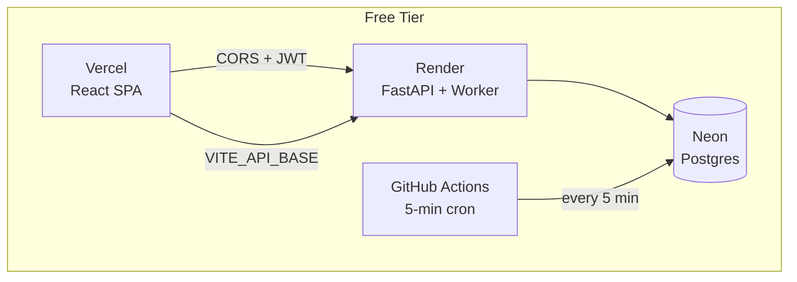

# Architecture

PulseWatch is a full-stack monitoring platform: React SPA frontend, FastAPI async backend, PostgreSQL database, and a distributed worker with claim-locking.

## System Overview

## Components

| Component | What it does |
|:---|:---|
| **FastAPI App** | REST API, CORS, JWT auth, public status pages |
| **Worker Scheduler** | Claims due monitors via `SELECT FOR UPDATE SKIP LOCKED`, runs HTTP probes |
| **Telegram Bot** | Long-polling bot for alerts, account linking, plan payments (Stars) |
| **Notification Dispatcher** | Routes alerts to Telegram / Email / Discord / Slack / Webhooks |
| **AI Explainer** | Optional OpenRouter-powered incident explanations |
| **React SPA** | Dashboard, monitor config, settings, public status pages |
| **GitHub Actions Cron** | Always-on worker (every 5 min) covering Render's sleep periods |

## Data Flow

1. **Scheduler** finds due monitors and claims them atomically (lease + `SKIP LOCKED`)
2. **Worker** probes each endpoint (HTTP/HTTPS/heartbeat), records the check
3. **State machine** compares result to threshold — one failure doesn't alert
4. After 3 consecutive failures → opens incident → dispatches alerts
5. Recovery → resolves incident → sends recovery notification

## Claim-Lock Pattern

The worker uses `SELECT ... FOR UPDATE SKIP LOCKED` so concurrent replicas never process the same monitor. This makes it safe to run the worker on both Render (in-process) and GitHub Actions (cron) simultaneously — zero duplicate checks, zero duplicate alerts.

## Database Schema

- `users` — accounts, plans, trial status, Telegram linking, alert channels
- `monitors` — definitions, intervals, SSL config, claim lease
- `checks` — individual probe outcomes with timing
- `incidents` — failure timelines, severity, AI explanations, resolution
- `status_pages` — public page config (title, theme, capabilities)
- `api_tokens` — personal access tokens for API integration

## Security

- JWT authentication with bcrypt password hashing
- CORS restricted to configured origins
- Security headers: HSTS, CSP, X-Frame-Options, X-Content-Type-Options, Referrer-Policy, Permissions-Policy
- Rate limiting recommended via reverse proxy for production
