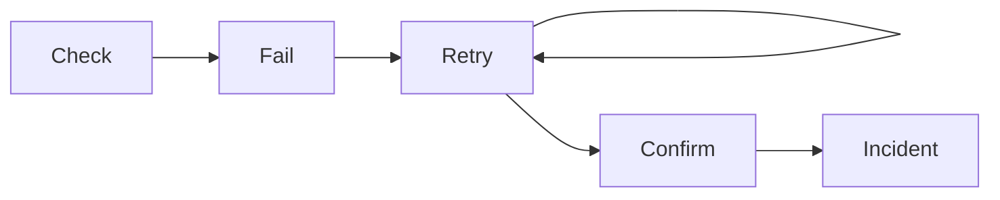

# Monitors

Monitors are the heartbeat of PulseWatch. This section covers supported monitor types, states, intervals, and retry behavior.

## Supported Types

### Website

Monitor any publicly accessible website or static endpoint.

Example target:

```bash
https://example.com
```

### API

Monitor REST endpoints and validate responses beyond status codes.

Example target:

```bash
https://api.example.com/health
```

### Heartbeat

Receive periodic heartbeats from scheduled jobs. If a heartbeat is not received before the timeout, PulseWatch creates an incident.

Best for:

- Cron jobs
- Backups
- CI/CD
- Scheduled scripts

## Monitor States

| State | Meaning |
| --- | --- |
| 🟢 Operational | Healthy and checking normally |
| 🟡 Degraded | Elevated latency or intermittent failures |
| 🔴 Down | Confirmed outage or persistent failure |
| ⚪ Paused | Monitoring stopped manually |

## Check Intervals

- `1 minute`
- `5 minutes`
- `10 minutes`
- `15 minutes`
- `30 minutes`

## Retry Logic

PulseWatch does not declare downtime after a single failed check. Instead it retries before opening an incident, which greatly reduces false alerts.


